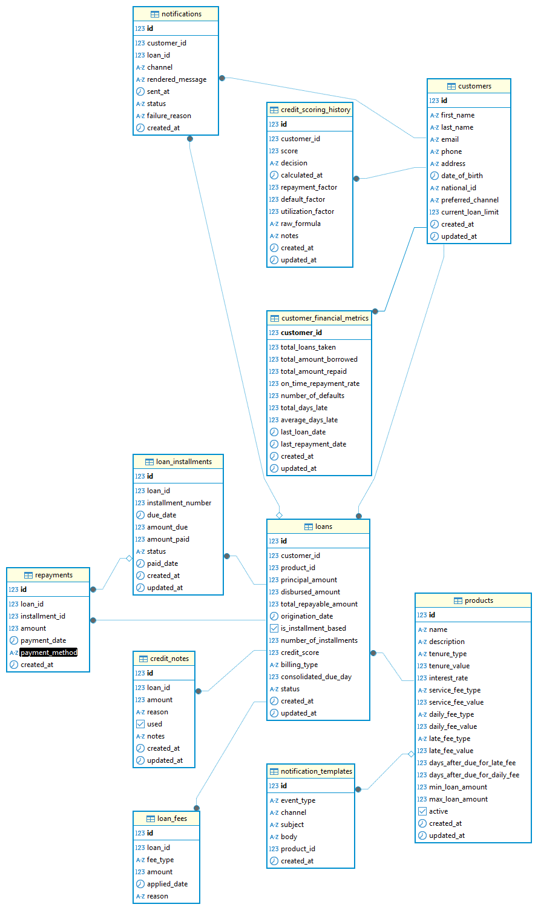

# Lending Application - Loan Management System

A production-ready loan management system built with Spring Boot, 
designed using Domain-Driven Design (DDD) principles, featuring automated loan processing, 
credit scoring, fee management, and event-driven notifications.

## Tech Stack

| Technology    | Version | Purpose                    |
|---------------|---------|----------------------------|
| Spring Boot   | 4.0.5   | Application framework      |
| Java          | 25      | Programming language       |
| PostgreSQL    | Latest  | Relational database        |
| Apache Pulsar | Latest  | Event-driven notifications |
| Flyway        | Latest  | Database migrations        |
| Docker        | Latest  | Containerization           |
| JWT           | -       | Authentication             |

## Quick Start

 1. Clone and start all services
    ```bash
      docker compose up --build
    ```
2. Access the application
App: http://localhost:9090
Swagger UI: http://localhost:9090/swagger-ui/index.html

3. Default credentials
    ```
    Username: ezra
    Password: ezra
    ```

## Architecture Overview
```
┌─────────────────────────────────────────────────────────┐
│                    Application                          │
├─────────────┬─────────────┬─────────────┬───────────────┤
│  Customer   │   Product   │    Loan     │  Repayment    │
│   Module    │   Module    │   Module    │    Module     │
├─────────────┼─────────────┼─────────────┼───────────────┤
│  Scoring    │ Notification│  Credit     │   Common      │
│   Module    │   Module    │   Notes     │   Module      │
└─────────────┴─────────────┴─────────────┴───────────────┘
```

### Key Architecture Features:
- **API-First Design:** Each module exposes an api interface, allowing modules to communicate without direct coupling
- **Ready for Microservices:** Modules can be extracted into separate services by simply implementing the API interfaces over HTTP
- **Common Module:** Shared configurations, exceptions, enums, and security details used across all modules
- **Event-Driven:** Apache Pulsar handles asynchronous notifications (loan creation, overdue alerts, payment confirmations)

**Database Design:** Flyway migrations (schema + seed data) in resources/db/migration/ with 11 tables covering customers, products, loans, installments, repayments, fees, metrics, scoring, notifications, and credit notes.

### Authentication
The application uses JWT (JSON Web Token) for authentication.
```
POST /api/auth/login

{
    "username": "ezra",
    "password": "ezra"
}

Response:
{
    "token": "eyJhbGciOiJIUzI1NiIs...",
    "expiresIn": 3600,
    "timeUnit": "SECONDS",
    "expiresAt": "2024-01-15T10:30:00"
}
```
**Using the Token:** Include the token in all subsequent requests:
```
Authorization: Bearer <your-jwt-token>
```

### API Endpoints
### 1. Authentication

| Method | Endpoint        | Description                                     |
|--------|-----------------|-------------------------------------------------|
| POST   | /api/auth/login | Login with username/password, returns JWT token |

### 2. Customer Management

| Method | Endpoint       | Description                                                   |
|--------|----------------|---------------------------------------------------------------|
| GET    | /api/customers | Get all customers (paginated, searchable by name/email/phone) |
| POST   | /api/customers | Create new customer with personal details and loan limit      |

Query Parameters (GET): searchTerm, page (default: 0), size (default: 10), sortBy (default: id), sortDirection (default: desc)

### 3. Product Management

| Method | Endpoint           | Description                                    |
|--------|--------------------|------------------------------------------------|
| GET    | /api/products      | Get all loan products (paginated)              |
| POST   | /api/products      | Create new loan product with fee configuration |
| PUT    | /api/products/{id} | Update existing product                        |

Product Configuration Includes: Tenure (DAYS/MONTHS), interest rate, service fee (FIXED/PERCENTAGE), daily fee with trigger days, late fee with trigger days, min/max loan amounts

### 4. Loan Management

| Method | Endpoint       | Description                 |
|--------|----------------|-----------------------------|
| GET    | /api/loans     | Get all loans (paginated)   |
| POST   | /api/loans/new | Submit new loan application |

Loan Processing Flow: Validates customer → Checks product → Performs credit scoring (auto-approve/reject) → Calculates interest/fees → Creates loan and installments → Updates metrics → Triggers Pulsar notification

### 5. Repayment

| Method | Endpoint        | Description           |
|--------|-----------------|-----------------------|
| POST   | /api/repayments | Make a loan repayment |

Repayment Logic: Allocates to oldest pending installments (FIFO), supports partial payments, updates installment status (PAID/PENDING/OVERDUE), closes loan when fully repaid, updates customer metrics

### 6. Credit Scoring

| Method | Endpoint                          | Description                           |
|--------|-----------------------------------|---------------------------------------|
| POST   | /api/scoring/customer-eligibility | Check customer's eligible loan amount |

Scoring Factors: Repayment history (40%), default history (30%), current utilization (20%), loan tenure (10%). Decisions: APPROVE (score ≥650), REVIEW (500-649), REJECT (<500)

### 7. Notifications

| Method | Endpoint                           | Description                  |
|--------|------------------------------------|------------------------------|
| POST   | /api/notifications/create-template | Create notification template |

Supported Channels: SMS, Email, Push. Event Types: Loan creation, payment reminders (3 days/1 day before), overdue alerts (3/7/14/30 days), repayment confirmations, fee applied alerts

### 8. Credit Notes

| Method | Endpoint          | Description                      |
|--------|-------------------|----------------------------------|
| GET    | /api/credit-notes | Get all credit notes (paginated) |

Credit Note Types: OVERPAYMENT, ADJUSTMENT, FEE_REVERSAL

## Database Schema


## Core Tables

| Table                      | Purpose                                              |
|----------------------------|------------------------------------------------------|
| customers                  | Customer personal info and loan limits               |
| products                   | Loan product configurations (fees, tenure, interest) |
| loans                      | Loan applications and status                         |
| loan_installments          | Individual payment schedules                         |
| repayments                 | Payment transaction history                          |
| loan_fees                  | Applied fees (service, daily, late)                  |
| customer_financial_metrics | Denormalized scoring data                            |
| credit_scoring_history     | Audit trail of all score calculations                |
| notification_templates     | Message templates with placeholders                  |
| notifications              | Sent notification history                            |
| credit_notes               | Overpayment and adjustment tracking                  |

## Key Relationships
```
Customers (1) ──────┐
                     ├──→ Loans (1) ──────→ Loan Installments (M)
Products (1) ────────┘         │
                               ├──→ Repayments (M)
                               ├──→ Loan Fees (M)
                               └──→ Credit Notes (M)
```

## Background Jobs
### Sweep Jobs (Run Automatically)
| Job                     | Schedule      | Purpose                                                                                                                                       |
|-------------------------|---------------|-----------------------------------------------------------------------------------------------------------------------------------------------|
| Overdue Loan Processing | Daily at 1 AM | Detects overdue installments, updates loan status to OVERDUE, applies late/daily fees, triggers notifications, writes off loans after 30 days |
| Payment Reminders       | Daily at 9 AM | Sends reminders for payments due in 3 days and final reminders for payments due tomorrow                                                      |

## Event-Driven Notifications (Apache Pulsar)
All major events trigger asynchronous notifications: Loan Created (SMS/Email), Payment Received (SMS), Loan Overdue (progressive alerts at 3/7/14/30 days), Fee Applied (SMS)

## Testing
### Run all tests
```
./mvnw clean test -Dspring.profiles.active=test
```

## Database Migrations
### Schema & Seed Data Location
```
src/main/resources/db/migration/
├── V1__schema.sql      # Database schema (11 tables)
└── V2__seed_data.sql   # Seed data (customers, products, loans, etc.)
```
### Manual Migration Commands
- Clean database (WARNING: deletes all data)
    ```
    ./mvnw flyway:clean \
      "-Dflyway.url=jdbc:postgresql://localhost:5434/lendingdb" \
      "-Dflyway.user=lendinguser" \
      "-Dflyway.password=lendingpass" \
      "-Dflyway.cleanDisabled=false"
    ```
- Run migrations
    ```
    ./mvnw flyway:migrate \
      "-Dflyway.url=jdbc:postgresql://localhost:5434/lendingdb" \
      "-Dflyway.user=lendinguser" \
      "-Dflyway.password=lendingpass"
    ```

## Sample API Workflows
### Complete Loan Journey
```
# Step 1: Login
    POST /api/auth/login
    {"username": "ezra", "password": "ezra"}

# Step 2: Create customer
    POST /api/customers
    {
        "firstName": "John",
        "lastName": "Doe",
        "email": "john@email.com",
        "phone": "0712345678",
        "nationalId": "12345678",
        "dateOfBirth": "1990-01-01",
        "preferredChannel": "EMAIL",
        "currentLoanLimit": 50000
    }

# Step 3: Apply for loan
    POST /api/loans/new
    {
        "customerId": 1,
        "productId": 1,
        "principalAmount": 25000,
        "disbursedAmount": 25000,
        "totalRepayableAmount": 28750,
        "isInstallmentBased": false,
        "billingType": "INDIVIDUAL"
    }

# Step 4: Make repayment
    POST /api/repayments
    {
        "loanId": 1,
        "amount": 10000,
        "paymentMethod": "MPESA"
    }
```

### Check Customer Eligibility
```
POST /api/scoring/customer-eligibility
{
    "customerId": 1,
    "requestedAmount": 50000
}
```

## Environment Variables
| Variable    | Default                                    | Description             |
|-------------|--------------------------------------------|-------------------------|
| DB_URL      | jdbc:postgresql://localhost:5434/lendingdb | Database connection URL |
| DB_USER     | lendinguser                                | Database username       |
| DB_PASSWORD | lendingpass                                | Database password       |
| JWT_SECRET  | your-secret-key                            | JWT signing secret      |

## Notes
- The application creates all database tables automatically on first run via Flyway
- Seed data is loaded automatically with sample customers, products, and loans
- JWT tokens expire after 1 hour (configurable)
- All monetary values use DECIMAL(15,2) for precision
- The system supports both installment-based and lump-sum loans
- Consolidated billing allows multiple loans to share a single due date

## Troubleshooting
### Issue: Port 9090 already in use
```
lsof -i :9090
kill -9 <PID>
```

### Issue: Database connection refused
```
docker ps | grep postgres
docker compose up -d postgres
```

### Issue: Flyway migration fails
```
# clean fly
./mvnw flyway:clean "-Dflyway.url=jdbc:postgresql://localhost:5434/lendingdb" "-Dflyway.user=lendinguser" "-Dflyway.password=lendingpass" "-Dflyway.cleanDisabled=false"

# perform migration
./mvnw flyway:migrate "-Dflyway.url=jdbc:postgresql://localhost:5434/lendingdb" "-Dflyway.user=lendinguser" "-Dflyway.password=lendingpass"
```
